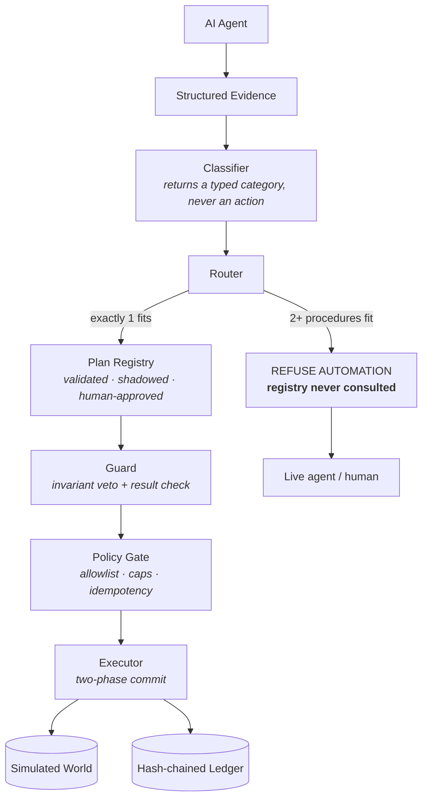

# Rote

**An authority layer that decides when an AI-derived financial procedure has earned deterministic
execution authority — and refuses to automate when the evidence is ambiguous.**

> ⚠️ **Offline research prototype. `research grade: False`.** The financial world, the agent and the
> classifier are deterministic stand-ins written for this project. No real payment rail, no bank, no
> external API, no credentials, no real money. Nothing here is production financial infrastructure.

---

## The problem

AI agents can reason about settlement exceptions perfectly well. The dangerous part is giving that
reasoning **direct authority to move money**, because the characteristic failure is not a crash — it
is being *confidently wrong while producing a completely plausible action*.

Take a real shape of this problem. A settlement line does not match, and the bank paid less than
expected. That single fact is consistent with several different explanations:

| Explanation | What the correct resolution does |
|---|---|
| **fee mismatch** | post a `fee` adjustment, mark the record `matched` |
| **partial payment** | post a `shortfall` adjustment, mark the record `partially_settled` |
| **duplicate entry** | void the duplicated bank line first |
| **timing cutoff** | post nothing at all, just match it |

These are *different financial procedures*. A system that picks the most likely explanation and acts
on it will sometimes post the wrong adjustment with the wrong reason and close the record in the
wrong state — and it will look completely normal in the logs.

**We measured exactly this.** An early version of Rote automated all 500 evaluated exceptions and got
**60 of them wrong**. Every safety layer passed those sixty: the policy gate permitted them, the guard
passed them, the precondition held, execution was deterministic, and the replay was byte-identical.
The error was in *meaning*, and none of those layers reasons about meaning.

## What Rote does

Rote sits between the agent's reasoning and any financial action.

```
AI Agent
   ↓
Structured evidence
   ↓
Rote
   ↓
Does exactly one procedure fit the evidence?
   ├── YES → validated plan → Guard → Gate → Execute → Ledger
   └── NO  → refuse automation → hand to the live agent / a human
```

**Rote does not replace the agent.** The agent reasons. Rote decides whether that reasoning has
earned the authority to be repeated deterministically, without a model in the loop and without a
human watching each time.

Concretely, Rote records what the agent did across many verified runs, compiles the repeated
procedure into a typed plan with **no language model in it**, validates that plan against held-out
recordings, runs it in shadow with no authority, requires a named human to sign it off — and then, at
the moment of use, asks whether the evidence identifies *exactly one* procedure. If two fit, it
refuses.

## Why this matters

- **Ambiguity is the real risk.** Two procedures that both fit the same facts do different things
  with money. Guessing between them is indistinguishable from working correctly, right up until an
  auditor asks.
- **Deterministic execution is provable.** A compiled plan produces one outcome hash across twenty
  identical runs. An agent with any exploration produced up to thirteen different outcomes on the
  same input.
- **Safety boundaries are structural, not advisory.** No component can reach a tool directly; every
  call passes an allowlist, a per-category money cap, and a gate-derived idempotency key the caller
  cannot choose.
- **Auditability.** Every decision writes to a hash-chained append-only ledger. `intent` is recorded
  *before* the call, so a crash between the two leaves an `unknown` for a human rather than a silent
  double-post.
- **Controlled automation.** Authority can be removed automatically; it can only ever be *granted* by
  a named person, and there is no override flag (a test fails if one appears).

## Architecture



| Component | Responsibility |
|---|---|
| **Classifier** | Reads structured fields, returns a typed enum member. Holds no tools; free text can only ever change *which enum member*, never produce an action. |
| **Router** | Counts how many categories' preconditions fit. **2+ → refuse, before any plan lookup.** |
| **Plan Registry** | Owns plan lifecycle: `DRAFT → SHADOW → ACTIVE`. No plan reaches `ACTIVE` without a passing replay validation, N agreeing shadow runs, and a named human. No override parameter exists. |
| **Guard** | Checks the proposed action *before* the gate (invariant veto) and the returned result *before* it becomes state. Threshold chosen by an evidence-based sweep, not by eye. |
| **Policy Gate** | The only path to a tool. Allowlist, per-category money caps, rolling spend window, and gate-owned idempotency keys. |
| **Executor** | Walks the compiled plan. Two-phase commit: a result is quarantined until the Guard passes it. |
| **Ledger** | Append-only, hash-chained. `intent` → `outcome`, plus every gate verdict including refusals. |

## The key design principle

> **Rote does not optimise for maximum automation. It optimises for automation that has earned
> authority.**

This is a deliberate trade, and it costs real coverage. When the evidence supports two incompatible
procedures, Rote gives up the case rather than guessing — even though guessing would have been right
much of the time.

## Research result

| Metric | v1 — automate whenever a plan exists | v2 — refuse when evidence is ambiguous |
|---|---|---|
| Automated | 500 / 500 | **184 / 500** |
| Coverage | 100% | **36.8%** |
| Accuracy | 88.0% | **100%** |
| **Confidently wrong** | **60** | **0** |

v1 automated everything and produced 60 wrong resolutions — all of them `partial_payment` cases
routed to the `fee_mismatch` procedure.

Five pre-registered experiments then investigated whether those errors could be separated
deterministically from evidence available *before acting*:

| Experiment | Result | What it eliminated |
|---|---|---|
| Fee-schedule distance | separated perfectly at n=500 | — (looked solved) |
| Margin stability, 5 seeds, n→5000 | margin collapsed **36 → 6 → 0** | any tolerance-based fee rule |
| Merchant notes, 3 seeds, 15,000 cases | independent of category | any text classifier, **including an LLM** |
| Settlement status | constant `unmatched` everywhere | the cheapest hypothesis |
| Shortfall fraction | 58.1% of partials inside the fee range | the last deterministic signal |

**The evidence did not support a safe deterministic discriminator.** So v2 introduced ambiguity
refusal instead: 184 cases remained safe to automate, 316 were refused, and **0 wrong actions
occurred in the evaluated workload**.

**Read this precisely.** v2 is not "better AI" — it is *level* with the agent on accuracy (500/500
each), never better. The finding is:

> Rote trades automation coverage for the elimination of confident errors in the evaluated workload.

Synthetic deterministic environment · offline stand-in agent and classifier · not production
accuracy · `research_grade = False`.

## Live demo

The repository contains a complete local end-to-end demo.

```
Browser → FastAPI → SessionRuntime → Classifier / Router
                                   → Plan / Guard / Gate
                                   → Simulated financial world
                                   → Hash-chained ledger
```

**This demo does not connect to real payment rails and moves no real money.** That is intentional.
The purpose is to demonstrate the *control architecture* safely: one persistent world, one policy
gate, one ledger, and 500 real exceptions you can pick from and watch decide.

## Demo screenshots

### 1 — Understand the product


*The product in about 30 seconds: the danger, the authority layer, the decision branch, and the
research result that produced it.*


*500 exceptions are available for investigation. Nothing executes merely because the queue exists —
the "Would" column is a routing preview with no plan fetched.*

### 2 — See automation


*Trusted structured facts on the left; the merchant's free text quarantined on the right. Every
recorded tool call carries its gate verdict.*


*Exactly one procedure fits. The plan's provenance is shown argument by argument — 162/162 support,
63/63 held-out replay, signed off by a named human.*


*AUTOMATE: guard and gate passed, four steps executed, zero model calls after classification, and
the run replays to a byte-identical outcome hash.*

### 3 — See refusal


*The hero safety case. Two procedures are consistent with the same evidence, and the registry was
consulted **zero** times.*


*REFUSE AUTOMATION: zero compiled steps, zero ledger entries, world hash unchanged — and the
competing procedures are named for the human who picks it up. "Refusing is not a failed attempt."*

### 4 — See safety


*A valid, human-approved plan meets a bank response that has changed shape. The Guard rejects the
result before it can become state; zero steps commit.*


*Every decision is auditable rather than opaque: `intent`, `outcome` and `gate_verdict` entries in a
hash-chained log that verifies.*

### 5 — Research evidence

The v1 → v2 comparison is the research panel on the landing page above
([`01-landing.png`](docs/screenshots/01-landing.png)); the authoritative numbers are in the
[Research result](#research-result) table.


*Readiness signal: `ready`, `ledger_valid`, `backlog=500`, and `research_grade: false` served by the
application itself.*

## Running locally

```bash
conda run -n rote python -m uvicorn rote.web.app:app --host 127.0.0.1 --port 8000
```

Warmup takes roughly **52 seconds** — plans are compiled at startup so nothing waits mid-demo. The
port does not accept connections until warmup finishes, so *"it answers"* is the readiness signal.
Watch for `warmup_complete … note="READY"` in the console, or poll:

```bash
curl -s http://127.0.0.1:8000/health
# {"ready":true,"warmup_seconds":51.69,"scenarios":6,"backlog":500,
#  "ledger_entries":0,"ledger_valid":true,"research_grade":false}
```

Then open **http://127.0.0.1:8000/**

Between rehearsals, restore a clean world, gate and ledger without recompiling:

```bash
curl -X POST http://127.0.0.1:8000/api/reset
```

## Demo flow (5 minutes)

1. **Problem** — the landing page: reasoning is fine, authority is the danger.
2. **Automation** — pick a case from the live queue and resolve it: one fitting procedure, guard and
   gate, zero model calls after classification.
3. **Ambiguity refusal** — pick an ambiguous case: two procedures fit, **zero plan lookups**, nothing
   executes, nothing is written.
4. **Adversarial safety** — schema drift: the Guard rejects a divergent result before commit.
5. **Ledger** — the chain verifies; `intent` is written before the call.
6. **v1 vs v2** — 60 wrong to 0, at the cost of 63% of coverage. That trade is the product.

## Safety properties

Each of these is enforced by code and pinned by tests:

- **Ambiguity stops before plan lookup.** The registry is never consulted for an ambiguous case —
  verified across all 316 refusals in a full live sweep.
- **The Guard rejects divergent results** before they become trusted state (two-phase commit).
- **The Gate is the only path to a tool.** Allowlist, per-category caps, rolling spend window.
- **Idempotent replay prevents duplicate action.** Keys are derived by the gate; callers cannot
  supply one. A replay returns the recorded result and writes no second `intent`.
- **The ledger records intent, outcome and every gate verdict**, hash-chained and verifiable.
- **Evaluation baselines are immutable**, checked by SHA-256 in the test suite.
- **The runtime cannot import evaluation code** — enforced by import-linter contracts, not
  convention.

## Evaluation

Two independent numbers, and they should not be conflated.

**Research evaluation** (offline, from a JSONL run log, `docs/baselines/`): the v1 → v2 comparison
above, computed by the evaluator over 500 exceptions.

**Live demo verification** (a full sweep through the real `SessionRuntime`, not the evaluation
harness):

```
cases              500        automated 184        refused 316        wrong 0
route reasons      {ambiguous_evidence: 316, plan_matched: 184}
plan lookups       184  (exactly the automated cases)
executed steps     518        guard inspections 1036
world changes      184        ledger 0 → 1036      ledger valid True
checker verdicts   {pass: 184, undetermined: 316}

ambiguous safety violations: none
automated safety violations: none
```

The live runtime reproduces the v2 result exactly through an entirely different code path.

## Honest limitations

- **Synthetic financial world.** Records, bank lines, fee schedules and FX rates are generated.
- **Deterministic stand-in agent and classifier.** No language model is involved anywhere.
- **`research_grade = False`.** No number in this repository is evidence about real reconciliation or
  about language models.
- **No real payment rail**, no bank connectivity, no external API, no credentials.
- **No authentication.** `human:ops-lead-42` is a demo naming convention for the approver, not an
  identity system.
- **Two compiled systems are held in memory** (normal and kill-switch) — a demo shape, not a
  deployment one.
- **Startup warmup of ~52 seconds.**
- **No claim of production-level accuracy.** Rote is level with the agent, never better.

## Project status

**Ready for buildathon demo.** Rote is demo-ready and experimentally validated in its synthetic
environment. **It is not production-ready financial infrastructure.**

## Roadmap

1. Real financial-system integration behind the Gate.
2. Real agent and model evaluation (the second-model skeleton-agreement experiment remains undone).
3. Production authentication and approval workflows.
4. Persistent state and audit storage.
5. Larger and real-world datasets.
6. Stronger second-model evaluation.

## Development

```bash
conda run -n rote python -m pytest          # 977 tests
conda run -n rote ruff check .
conda run -n rote ruff format --check .
conda run -n rote mypy --strict rote tests
conda run -n rote lint-imports              # 11 architectural contracts
```

Design decisions and the full experimental record live in
[`docs/ARCHITECTURE.md`](docs/ARCHITECTURE.md), [`docs/IMPLEMENTATION_PLAN.md`](docs/IMPLEMENTATION_PLAN.md)
and [`docs/JOURNAL.md`](docs/JOURNAL.md), including the experiments that failed and the claims that
were retracted.

## License

No licence file is present in this repository. All rights reserved by the author unless a licence is
added.
